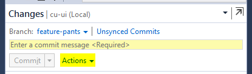

# Using Github to Contribute to CU-UI

## 1. Adding Your Repository To Visual Studio

1.  In Visual Studio 2013 Update 2, click the "View" menu and select "Team Explorer".
    -   It's a good idea to always keep the team explorer open.
2.  Click the connect icon in the team explorer.
    
    
3.  Visual Studio may prompt you to install 3rd party tools. Install these before continuing if it does.
4.  Under "Local Git Repositories" select "Clone".
5.  Paste in your repository URL into the yellow box. This URL can be found here in the GitHub UI.
    
    
6.  Choose a path where you would like the repository to clone to.
7.  Click the "Clone" button.

## 2. Adding The CSE Remote

1.  Open the connect screen (accessed in 1.2) right click your clone and select "Open Command Prompt".
2.  Type the following commands:
    1. Add the remote: `git remote add upstream https://github.com/csegames/cu-ui.git`
    2. Retrieve data from the remote: `git fetch upstream`
3.  You should see a message as follows: `* [new branch] master -> upstream/master`

## 3. Creating a Development Branch

**NEVER** commit your code to the "master" branch.

1.  Open the connect screen (accessed in 1.2) and double click your clone. Alternatively, if your clone is already active simply click the home icon.
    
    
2.  Click on the "Branches" category.
3.  Click the "New Branch" link.
    
    
4.  Type a name for the branch, for example: "feature-pants".
5.  Make sure that "master" is selected from the dropdown.
    
    
6.  Right click the new branch and select "Publish Branch".

## 4. Committing a Local Change

Always Ensure that you are working on the correct branch **before** starting work. This can be done by double-clicking it in the branches list (accessed in 3.2).

1.  Click the home icon (as shown in 3.1).
2.  Click the "Changes" category.
3.  3 categories will appear. Using these you need to select which files should be included in the commit.
    -   **Included Changes:** These are the changes that will be included with your commit. To exclude a changed file right click on it and select "Exclude".
    -   **Excluded Changes:** The are changes to known-files that you have opted to exclude from your commit. To include a changed file right click on it and select "Include".
    -   **Untracked Files:** These files have been detected as new files, but are not yet being tracked by Git. To track a file right click on it and select "Add".
4.  Along the top of the commit area enter a commit message.
5.  Click the "Commit" button.

## 5. Pushing Your Changes to GitHub

1.  Click the home icon (as shown in 3.1).
2.  Click the "Unsynced Commits" category.
3.  Ensure the correct branch is selected.
3.  Click the "Sync" button.

## 6. Doing a Pull Request

Always make sure that you are confident that your unit of work is complete before creating a pull request. Also ensure that you have committed all your changes. The "Actions" menu is accessible from virtually anywhere in the Git interface. It can be used to open a Command Prompt.

1.  Open a Command Prompt.
2.  Type the following commands:
    1.  Retrieve data from the csegames repo: `git fetch upstream`
    2.  Check out your master branch: `get checkout master`
    3.  Merge their changes into your fork: `git merge upstream/master`
        -   There should be no conflicts because you **never commit to master**.
3.  Switch back to Visual Studio 2013.
4.  Return to the Branches screen (accessed in 3.2).
5.  Right click your branch and select "Switch".
6.  Right click your branch and select "Merge...".
7.  Select "master" as the source (left-hand-side) branch.
8.  You may get some conflicts, follow [the instructions here](http://msdn.microsoft.com/en-us/library/dd286559.aspx) to resolve them.
9.  Open GitHub in your browser window.
10. Ensure that your branch is selected.
    
    
11. Click the Compare and Review icon.
    
    
12. Fill in the details about your Pull Request.
13. Remember to cease working on that branch until CSE either approve or decline the PR.
